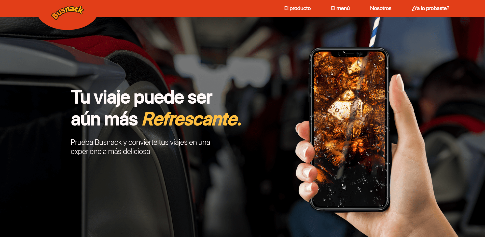
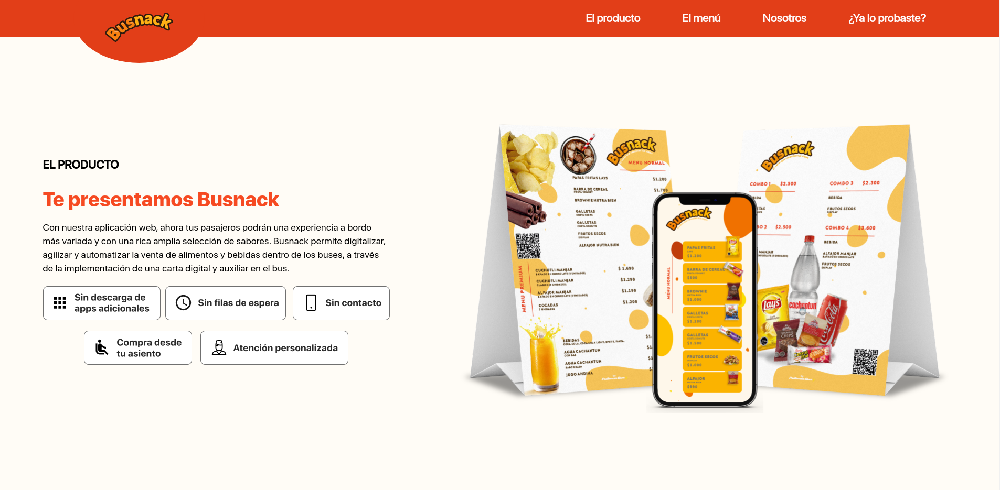
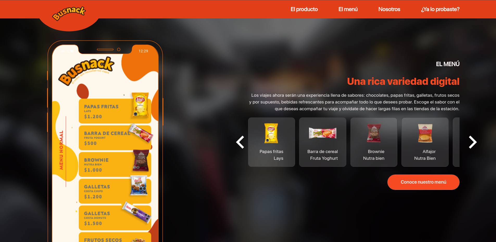
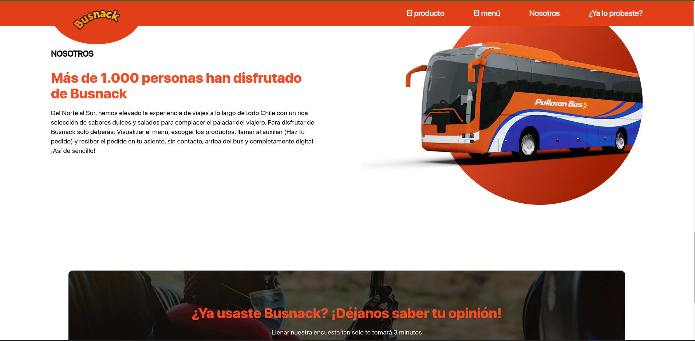

# Landing Busnack
Landing to promote web application. Busnack allows to digitize, streamline and automate the sale of food and beverages inside the buses, through the implementation of a digital and auxiliary menu in the bus.






### Lista de Comandos

```sh
npm install

# Compiles and hot-reloads for development
npm run serve

# Compiles and minifies for production
npm run build

# Lints and fixes files
npm run lint
```
